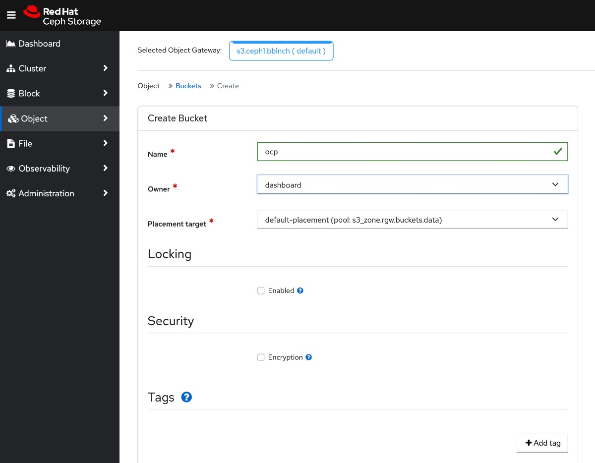
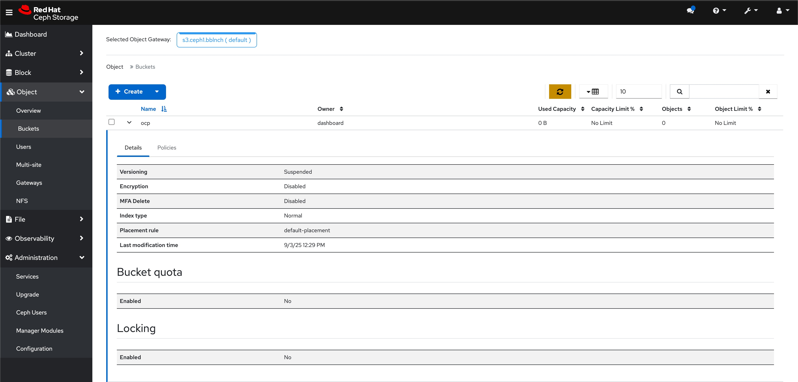
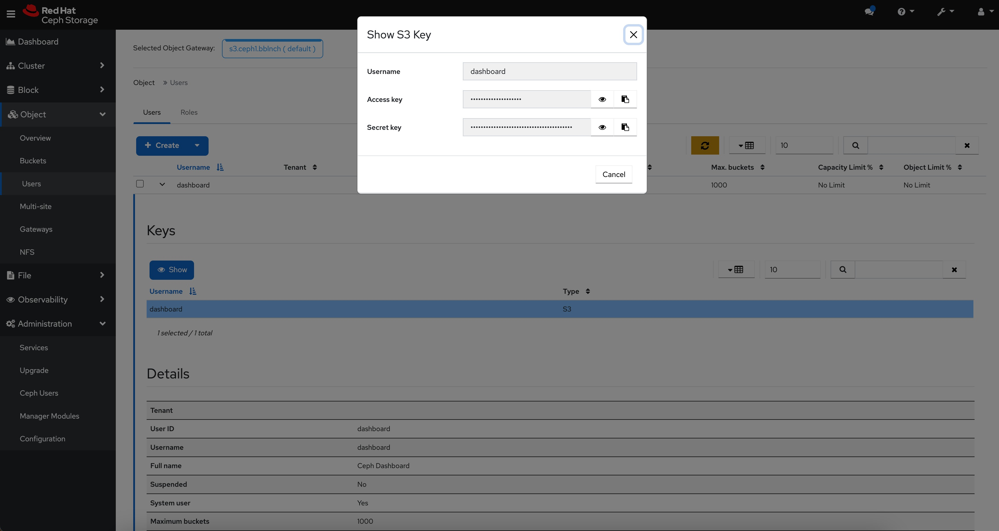

## Background

This demo looks at how we can connect 2 OpenShift clusters to an external CEPH storage cluster and make use of OADP (OpenShift API for Data Protection) to backup stateful workloads in the primary cluster and restore it in the secondary cluster.

## Setting up the Environment

- We will need to first install the OADP Operator using the OpenShift Console

  1. In the OpenShift Container Platform web console, click Operators → OperatorHub.
  2. Use the Filter by keyword field to find the OADP Operator.
  3. Select the OADP Operator (select the one from Red Hat source, instead of the Community source) and click Install.
  4. Accept default values and click Install to install the Operator in the openshift-adp project.
  5. Click Operators → Installed Operators to verify the installation.


- Once the OADP Operator is installed, we will proceed to create the required object storage in the CEPH cluster





- The credentials, in this case, will be that of the `dashboard` user, which can be retrieved under the user tab




- With these information, we will be able to create the secret in the OpenShift cluster that will be used to authenticate with the object storage. In this case, we will create a YAML file, i.e. `credentials-velero` that looks like this:

```
[default]
aws_access_key_id=changemeAccessKey
aws_secret_access_key=changemeSecretAccessKey
```

- And we will create the secret using the following command

```
oc create secret generic cloud-credentials -n openshift-adp --from-file cloud=credentials-velero
```

- And create the `DataProtectionApplication` file

```
---
apiVersion: oadp.openshift.io/v1alpha1
kind: DataProtectionApplication
metadata:
  name: openshift-dpa
  namespace: openshift-adp
spec:
  backupLocations:
    - velero:
        config:
          insecureSkipTLSVerify: 'true'
          profile: default
          region: changeme
          s3ForcePathStyle: 'true'
          s3Url: 'http://changeme.example.com:8000'
        credential:
          key: cloud
          name: cloud-credentials
        default: true
        objectStorage:
          bucket: ocp
          prefix: ocpcluster1
        provider: aws
  configuration:
    nodeAgent:
      enable: true
      uploaderType: kopia
    velero:
      defaultPlugins:
        - kubevirt
        - aws
        - csi
        - openshift
      defaultSnapshotMoveData: true
      defaultVolumesToFSBackup: false
      featureFlags:
        - EnableCSI
      resourceTimeout: 10m
```

- The same configurations will be configured on both the primary and secondary clusters. The object storage bucket will be visible to both the clusters in this case and the content that is backed up from the primary cluster to the bucket can then be used to restore the stateful workload in the secondary cluster.

- The stateful application that we will be using in this demo will be mssql. Its associated YAML definitions can be found in the `mssql.yaml` in this repo.

- We will deploy the stateful application in the primary cluster:

```
oc apply -f mssql.yaml
```
